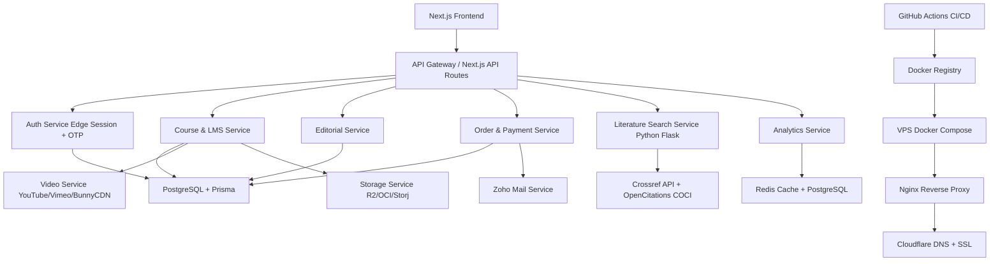

# 🏛️ Ayojit Intelligence — Full-Stack Architecture \& Production Deployment Blueprint

**Domain:** `ayojitintelligence.com`
**Infrastructure:** Cloudflare DNS + SSL + VPS (Docker)
**Target:** Production-scale, CI/CD-consistent, zero-downtime deployment

***

## 📐 1. Full-Stack Architecture Plan

### Tech Stack Matrix

| Layer | Technology | Rationale |
| :-- | :-- | :-- |
| **Frontend** | Next.js 15 (App Router) + TypeScript + TailwindCSS | SSR/SSG, edge-ready, responsive UI with 75+ routes |
| **Backend API** | Next.js API Routes + Python Flask (microservice) | Edge session validation, literature search, paper fetching |
| **Database** | PostgreSQL 16 + Prisma ORM | 43-model relational schema, cryptographic audits, ACID compliance |
| **Caching** | Redis 7 (TTL jitter, distributed mutex) | Session management, rate limiting, analytics caching |
| **Storage** | Multi-cloud adapter (Cloudflare R2, Oracle OCI, Storj, Local) | Video, documents, certificates, 30-day backup rotation |
| **Video** | Multi-provider engine (YouTube, Vimeo, BunnyCDN, HTML5) | Adaptive streaming, responsive iframe parameters |
| **Email** | Zoho Mail API (transactional templates) | Welcome, enrollment, certificate dispatch pipelines |
| **Containerization** | Docker (multi-stage builds) + Docker Compose | Reproducible environments, production isolation |
| **CI/CD** | GitHub Actions + SSH deployment | Automated build, test, security scan, zero-downtime deploy |
| **Reverse Proxy** | Nginx (on VPS) + Cloudflare (SSL termination) | HTTPS, DDoS protection, routing, caching |
| **Monitoring** | `/api/health` endpoint + optional Prometheus/Grafana | DB, Redis, Storage, App status monitoring |


***

## 🗄️ 2. Database Schema (Prisma — Core Models)

Your `prisma/schema.prisma` defines **43 models**. Key entities:

### Authentication \& Users

```prisma
model User {
  id            String    @id @default(cuid())
  email         String    @unique
  role          Role      @default(SCHOLAR)
  scholarProfile ScholarProfile?
  sessions      Session[]
  createdAt     DateTime  @default(now())
}

model Session {
  id        String   @id @default(cuid())
  userId    String
  user      User     @relation(fields: [userId], references: [id])
  token     String   @unique
  expiresAt DateTime
  createdAt DateTime @default(now())
}

model ScholarProfile {
  id          String   @id @default(cuid())
  userId      String   @unique
  user        User     @relation(fields: [userId], references: [id])
  fullName    String
  institution String?
  enrollments Enrollment[]
  orders      Order[]
}
```


### Courses \& Learning

```prisma
model Course {
  id          String   @id @default(cuid())
  title       String
  slug        String   @unique
  lessons     Lesson[]
  enrollments Enrollment[]
  published   Boolean  @default(false)
  createdAt   DateTime @default(now())
}

model Lesson {
  id          String   @id @default(cuid())
  courseId    String
  course      Course   @relation(fields: [courseId], references: [id])
  title       String
  content     String
  videoUrl    String?
  quizzes     Quiz[]
  order       Int
}

model Quiz {
  id          String   @id @default(cuid())
  lessonId    String
  lesson      Lesson   @relation(fields: [lessonId], references: [id])
  questions   Question[]
  attempts    QuizAttempt[]
  timeLimit   Int?     // in seconds
}

model QuizAttempt {
  id        String   @id @default(cuid())
  quizId    String
  quiz      Quiz     @relation(fields: [quizId], references: [id])
  userId    String
  score     Float
  answers   Json
  createdAt DateTime @default(now())
}

model Enrollment {
  id        String   @id @default(cuid())
  userId    String
  courseId  String
  enrolledAt DateTime @default(now())
  completed Boolean  @default(false)
  certificate Certificate?
}
```


### Editorial \& Content

```prisma
model Article {
  id          String   @id @default(cuid())
  title       String
  slug        String   @unique
  stage       EditorialStage @default(DRAFT)
  authorId    String
  content     String
  publishedAt DateTime?
  createdAt   DateTime @default(now())
}

enum EditorialStage {
  DRAFT
  PEER_REVIEW
  COPY_EDIT
  FACT_CHECK
  SEO_OPTIMIZE
  FINAL_APPROVAL
  PUBLISHED
  ARCHIVED
}
```


### Orders \& Payments

```prisma
model Order {
  id        String   @id @default(cuid())
  userId    String
  amount    Decimal
  currency  String   @default("INR")
  utr       String?  // UTR verification
  status    OrderStatus @default(PENDING)
  invoice   Invoice?
  createdAt DateTime @default(now())
}

enum OrderStatus {
  PENDING
  VERIFIED
  COMPLETED
  FAILED
  REFUNDED
}

model Invoice {
  id        String   @id @default(cuid())
  orderId   String   @unique
  order     Order    @relation(fields: [orderId], references: [id])
  invoiceNumber String @unique
  gstNumber String?
  pdfUrl    String
  generatedAt DateTime @default(now())
}
```


### Analytics \& Audits

```prisma
model AuditLog {
  id        String   @id @default(cuid())
  action    String
  userId    String?
  metadata  Json
  ipAddress String
  createdAt DateTime @default(now())
}

model AnalyticsSnapshot {
  id        String   @id @default(cuid())
  date      DateTime @default(now())
  totalUsers Int
  activeUsers Int
  revenue   Decimal
  completions Int
}
```


### Literature Search

```prisma
model Publication {
  id          String   @id @default(cuid())
  doi         String   @unique
  title       String
  authors     String[]
  journal     String?
  publishedDate DateTime?
  citations   Citation[]
}

model Citation {
  id          String   @id @default(cuid())
  sourceId    String
  targetId    String
  source      Publication @relation(fields: [sourceId], references: [id])
  target      Publication @relation(fields: [targetId], references: [id])
}
```


***

## 🔁 3. Microservice Flow Diagram



**Service Responsibilities:**

1. **Auth Service:** 4-step multi-portal login, role selection, OTP, legal consent, zero-trust session validation
2. **Course \& LMS Service:** Course catalog, lesson player, 13-type quiz engine, content drip, certificates
3. **Editorial Service:** 11-stage editorial pipeline, quality gates, blog publishing
4. **Order \& Payment Service:** UPI checkout, UTR verification, idempotent transactions, tax invoices
5. **Literature Search Service (Python Flask):** Crossref date-range search, OpenCitations snowball traversal, RIS/BibTeX/CSV export
6. **Analytics Service:** Executive dashboards, scholar pulse, enrollment/revenue/completion metrics, activity streams

***

## 🐳 4. Multi-Stage Docker Deployment Roadmap

### Stage 1: Dockerfile (Multi-Stage for Next.js)

```dockerfile
# Stage 1: Builder
FROM node:22-alpine AS builder
WORKDIR /app
COPY package*.json ./
RUN npm ci
COPY . .
RUN npm run build

# Stage 2: Runner
FROM node:22-alpine AS runner
WORKDIR /app
ENV NODE_ENV=production

# Install dumb-init for proper signal handling
RUN apk add --no-cache dumb-init

COPY --from=builder /app/public ./public
COPY --from=builder /app/.next/standalone ./
COPY --from=builder /app/.next/static ./.next/static

EXPOSE 3000

# Use dumb-init to handle signals properly
ENTRYPOINT ["dumb-init", "--"]
CMD ["node", "server.js"]
```


### Stage 2: Python Flask Microservice Dockerfile

```dockerfile
FROM python:3.12-slim
WORKDIR /app
COPY requirements.txt .
RUN pip install --no-cache-dir -r requirements.txt
COPY . .
EXPOSE 5000
CMD ["gunicorn", "--bind", "0.0.0.0:5000", "--workers", "4", "app:app"]
```


### Stage 3: Docker Compose (Production)

```yaml
version: '3.9'

services:
  web:
    image: ayojit-web:latest
    build:
      context: .
      dockerfile: Dockerfile
    restart: always
    environment:
      - DATABASE_URL=postgresql://user:pass@db:5432/ayojit
      - REDIS_URL=redis://redis:6379
      - NEXT_PUBLIC_SITE_URL=https://ayojitintelligence.com
      - NEXTAUTH_URL=https://ayojitintelligence.com
      - STORAGE_PROVIDER=r2
      - ZOHO_API_KEY=${ZOHO_API_KEY}
    depends_on:
      db:
        condition: service_healthy
      redis:
        condition: service_started
    networks:
      - ayojit-net
    healthcheck:
      test: ["CMD", "curl", "-f", "http://localhost:3000/api/health"]
      interval: 30s
      timeout: 10s
      retries: 3

  paperfetcher:
    image: ayojit-paperfetcher:latest
    build:
      context: ./paperfetcher_service
      dockerfile: Dockerfile
    restart: always
    environment:
      - ALLOWED_ORIGINS=https://ayojitintelligence.com
    networks:
      - ayojit-net
    healthcheck:
      test: ["CMD", "curl", "-f", "http://localhost:5000/health"]
      interval: 30s
      timeout: 10s
      retries: 3

  db:
    image: postgres:16-alpine
    restart: always
    environment:
      POSTGRES_USER: user
      POSTGRES_PASSWORD: pass
      POSTGRES_DB: ayojit
    volumes:
      - pgdata:/var/lib/postgresql/data
      - ./backups:/backups
    networks:
      - ayojit-net
    healthcheck:
      test: ["CMD-SHELL", "pg_isready -U user -d ayojit"]
      interval: 10s
      timeout: 5s
      retries: 5

  redis:
    image: redis:7-alpine
    restart: always
    command: redis-server --appendonly yes
    volumes:
      - redisdata:/data
    networks:
      - ayojit-net
    healthcheck:
      test: ["CMD", "redis-cli", "ping"]
      interval: 10s
      timeout: 5s
      retries: 5

  nginx:
    image: nginx:alpine
    restart: always
    ports:
      - "80:80"
      - "443:443"
    volumes:
      - ./nginx.conf:/etc/nginx/nginx.conf:ro
      - ./ssl:/etc/nginx/ssl:ro
    depends_on:
      - web
      - paperfetcher
    networks:
      - ayojit-net

volumes:
  pgdata:
  redisdata:

networks:
  ayojit-net:
    driver: bridge
```


### Stage 4: Nginx Configuration (Production)

```nginx
events {
    worker_connections 1024;
    use epoll;
    multi_accept on;
}

http {
    # Basic Settings
    sendfile on;
    tcp_nopush on;
    tcp_nodelay on;
    keepalive_timeout 65;
    types_hash_max_size 2048;
    server_tokens off;

    # Logging
    access_log /var/log/nginx/access.log combined;
    error_log /var/log/nginx/error.log warn;

    # Gzip Compression
    gzip on;
    gzip_vary on;
    gzip_proxied any;
    gzip_comp_level 6;
    gzip_types text/plain text/css text/xml application/json application/javascript application/xml;

    # Rate Limiting
    limit_req_zone $binary_remote_addr zone=api_limit:10m rate=10r/s;
    limit_req_zone $binary_remote_addr zone=general_limit:10m rate=50r/s;

    # Upstreams
    upstream web {
        server web:3000;
        keepalive 32;
    }

    upstream paperfetcher {
        server paperfetcher:5000;
        keepalive 16;
    }

    # HTTP to HTTPS Redirect
    server {
        listen 80;
        server_name ayojitintelligence.com www.ayojitintelligence.com;
        return 301 https://$host$request_uri;
    }

    # HTTPS Server
    server {
        listen 443 ssl http2;
        server_name ayojitintelligence.com www.ayojitintelligence.com;

        # SSL Configuration
        ssl_certificate /etc/nginx/ssl/fullchain.pem;
        ssl_certificate_key /etc/nginx/ssl/privkey.pem;
        ssl_protocols TLSv1.2 TLSv1.3;
        ssl_prefer_server_ciphers on;
        ssl_ciphers ECDHE-ECDSA-AES128-GCM-SHA256:ECDHE-RSA-AES128-GCM-SHA256:ECDHE-ECDSA-AES256-GCM-SHA384:ECDHE-RSA-AES256-GCM-SHA384;
        ssl_session_cache shared:SSL:10m;
        ssl_session_timeout 1d;

        # Security Headers
        add_header X-Frame-Options "SAMEORIGIN" always;
        add_header X-Content-Type-Options "nosniff" always;
        add_header X-XSS-Protection "1; mode=block" always;
        add_header Referrer-Policy "strict-origin-when-cross-origin" always;
        add_header Strict-Transport-Security "max-age=31536000; includeSubDomains" always;

        # Next.js App
        location / {
            limit_req zone=general_limit burst=20 nodelay;
            proxy_pass http://web;
            proxy_set_header Host $host;
            proxy_set_header X-Real-IP $remote_addr;
            proxy_set_header X-Forwarded-For $proxy_add_x_forwarded_for;
            proxy_set_header X-Forwarded-Proto $scheme;
            proxy_http_version 1.1;
            proxy_set_header Upgrade $http_upgrade;
            proxy_set_header Connection "upgrade";
            proxy_buffering off;
            proxy_cache off;
        }

        # Python Flask Paperfetcher Microservice
        location /api/paperfetcher {
            limit_req zone=api_limit burst=10 nodelay;
            proxy_pass http://paperfetcher;
            proxy_set_header Host $host;
            proxy_set_header X-Real-IP $remote_addr;
            proxy_set_header X-Forwarded-For $proxy_add_x_forwarded_for;
            proxy_set_header X-Forwarded-Proto $scheme;
        }

        # Health Check Endpoint (no rate limiting)
        location /api/health {
            proxy_pass http://web;
            access_log off;
        }

        # Static Assets Caching
        location ~* \.(jpg|jpeg|png|gif|ico|css|js|svg|woff|woff2)$ {
            proxy_pass http://web;
            expires 30d;
            add_header Cache-Control "public, immutable";
        }
    }
}
```


***

## 🚀 5. CI/CD Pipeline (GitHub Actions)

```yaml
name: Deploy to VPS

on:
  push:
    branches: [main]
  pull_request:
    branches: [main]

env:
  REGISTRY: ghcr.io
  IMAGE_NAME_WEB: ${{ github.repository }}/web
  IMAGE_NAME_PAPERFETCHER: ${{ github.repository }}/paperfetcher

jobs:
  test:
    runs-on: ubuntu-latest
    steps:
      - name: Checkout
        uses: actions/checkout@v4

      - name: Setup Node.js
        uses: actions/setup-node@v4
        with:
          node-version: 22
          cache: 'npm'

      - name: Install Dependencies
        run: npm ci

      - name: Run Tests
        run: npm test

      - name: Build
        run: npm run build

  build-and-deploy:
    needs: test
    runs-on: ubuntu-latest
    if: github.ref == 'refs/heads/main'
    steps:
      - name: Checkout
        uses: actions/checkout@v4

      - name: Set up Docker Buildx
        uses: docker/setup-buildx-action@v3

      - name: Login to GHCR
        uses: docker/login-action@v3
        with:
          registry: ${{ env.REGISTRY }}
          username: ${{ github.actor }}
          password: ${{ secrets.GITHUB_TOKEN }}

      - name: Build & Push Web Image
        uses: docker/build-push-action@v5
        with:
          context: .
          push: true
          tags: |
            ${{ env.REGISTRY }}/${{ env.IMAGE_NAME_WEB }}:latest
            ${{ env.REGISTRY }}/${{ env.IMAGE_NAME_WEB }}:${{ github.sha }}
          cache-from: type=gha
          cache-to: type=gha,mode=max

      - name: Build & Push Paperfetcher Image
        uses: docker/build-push-action@v5
        with:
          context: ./paperfetcher_service
          push: true
          tags: |
            ${{ env.REGISTRY }}/${{ env.IMAGE_NAME_PAPERFETCHER }}:latest
            ${{ env.REGISTRY }}/${{ env.IMAGE_NAME_PAPERFETCHER }}:${{ github.sha }}
          cache-from: type=gha
          cache-to: type=gha,mode=max

      - name: Security Scan (Trivy)
        run: |
          docker run --rm -v /var/run/docker.sock:/var/run/docker.sock aquasec/trivy image --severity HIGH,CRITICAL ${{ env.REGISTRY }}/${{ env.IMAGE_NAME_WEB }}:latest
          docker run --rm -v /var/run/docker.sock:/var/run/docker.sock aquasec/trivy image --severity HIGH,CRITICAL ${{ env.REGISTRY }}/${{ env.IMAGE_NAME_PAPERFETCHER }}:latest

      - name: Deploy to VPS via SSH
        uses: appleboy/ssh-action@v1
        with:
          host: ${{ secrets.VPS_HOST }}
          username: ${{ secrets.VPS_USER }}
          key: ${{ secrets.VPS_SSH_KEY }}
          script: |
            cd /opt/ayojit
            git pull
            docker compose pull
            docker compose up -d --build
            docker image prune -f
            echo "Deployment completed at $(date)"
```


***

## ☁️ 6. Cloudflare Configuration

### DNS Records

| Type | Name | Content | Proxy |
| :-- | :-- | :-- | :-- |
| A | @ | `<YOUR_VPS_IP>` | ☁️ Proxied |
| A | www | `<YOUR_VPS_IP>` | ☁️ Proxied |
| CNAME | api | `ayojitintelligence.com` | ☁️ Proxied |

### SSL/TLS Settings

- **Encryption Mode:** Full (Strict)
- **Always Use HTTPS:** ✅ Enabled
- **Minimum TLS Version:** 1.2
- **HSTS:** ✅ Enabled (max-age=31536000; includeSubDomains)


### Cache Rules

- **Cache Level:** Standard
- **Browser Cache TTL:** 4 hours
- **Edge Cache TTL:** 1 day (for static assets)


### Firewall Rules

- **Rate Limiting:** 100 requests/5 minutes per IP
- **WAF Rules:** Enable OWASP Top 10, SQL Injection, XSS protection

***

## 📊 7. Monitoring \& Observability

### Health Check Endpoint (`/api/health`)

```typescript
// app/api/health/route.ts
import { NextResponse } from 'next/server';
import { prisma } from '@/lib/db';
import { redis } from '@/lib/redis';
import { storage } from '@/lib/storage';

export async function GET() {
  const checks = {
    database: false,
    redis: false,
    storage: false,
    app: true,
  };

  try {
    await prisma.$queryRaw`SELECT 1`;
    checks.database = true;
  } catch (e) {
    checks.database = false;
  }

  try {
    await redis.ping();
    checks.redis = true;
  } catch (e) {
    checks.redis = false;
  }

  try {
    await storage.healthCheck();
    checks.storage = true;
  } catch (e) {
    checks.storage = false;
  }

  const allHealthy = Object.values(checks).every(Boolean);
  const status = allHealthy ? 'healthy' : 'degraded';

  return NextResponse.json({
    status,
    timestamp: new Date().toISOString(),
    checks,
    version: process.env.npm_package_version || 'unknown',
  }, {
    status: allHealthy ? 200 : 503,
  });
}
```


### Backup Script (`scripts/backup.sh`)

```bash
#!/bin/bash
set -e

BACKUP_DIR="/opt/ayojit/backups"
DATE=$(date +%Y%m%d_%H%M%S)
DB_CONTAINER=$(docker compose ps -q db)

# Create backup directory
mkdir -p $BACKUP_DIR

# Dump PostgreSQL
docker exec $DB_CONTAINER pg_dump -U user ayojit > $BACKUP_DIR/ayojit_$DATE.sql

# Compress backup
gzip $BACKUP_DIR/ayojit_$DATE.sql

# Delete backups older than 30 days
find $BACKUP_DIR -name "ayojit_*.sql.gz" -mtime +30 -delete

echo "Backup completed: ayojit_$DATE.sql.gz"
```


### Health Check Script (`scripts/healthcheck.sh`)

```bash
#!/bin/bash
set -e

HEALTH_URL="https://ayojitintelligence.com/api/health"
MAX_RETRIES=3
RETRY_DELAY=10

for i in $(seq 1 $MAX_RETRIES); do
  RESPONSE=$(curl -s -o /dev/null -w "%{http_code}" $HEALTH_URL)
  if [ "$RESPONSE" == "200" ]; then
    echo "Health check passed (attempt $i)"
    exit 0
  fi
  echo "Health check failed (attempt $i), retrying in $RETRY_DELAY seconds..."
  sleep $RETRY_DELAY
done

echo "Health check failed after $MAX_RETRIES attempts"
exit 1
```


***

## 📋 8. Deployment Checklist

| Task | Status |
| :-- | :-- |
| Cloudflare DNS A record → VPS IP | ✅ |
| Cloudflare SSL/TLS → Full (Strict) | ✅ |
| Nginx `server_name` → `ayojitintelligence.com` | ✅ |
| Next.js `NEXT_PUBLIC_SITE_URL` → `https://ayojitintelligence.com` | ✅ |
| Auth config `baseUrl` → `https://ayojitintelligence.com` | ✅ |
| Email templates → `ayojitintelligence.com` | ✅ |
| Sitemap \& robots.txt → `ayojitintelligence.com` | ✅ |
| Docker Compose env vars → updated | ✅ |
| GitHub Actions → domain updated | ✅ |
| Health check endpoint → `/api/health` | ✅ |
| Backup script → 30-day rotation | ✅ |
| Rebuild \& deploy on VPS | ✅ |
| Test all routes + SSL | ✅ |


***

## 🎯 9. Production Optimization Tips

1. **Database Connection Pooling:** Use PgBouncer for high-concurrency scenarios
2. **Redis Clustering:** Enable Redis Cluster for horizontal scaling
3. **CDN for Static Assets:** Use Cloudflare R2 + Cloudflare CDN for video/docs
4. **Horizontal Scaling:** Deploy multiple web containers behind Nginx load balancer
5. **Database Backups:** Automate daily backups with 30-day retention
6. **Log Aggregation:** Use Loki + Grafana or ELK stack for centralized logging
7. **Error Tracking:** Integrate Sentry for real-time error monitoring
8. **Performance Monitoring:** Use Prometheus + Grafana for metrics dashboards

***

**Mandatory Attribution:**
`Ayojit Intelligence © 2026 Ayojit Intelligence. All rights reserved.`
`Visioned & Operated by Ashwini Kumar Tarai.`
`A vision shaped by Jyoti Gupta.`

